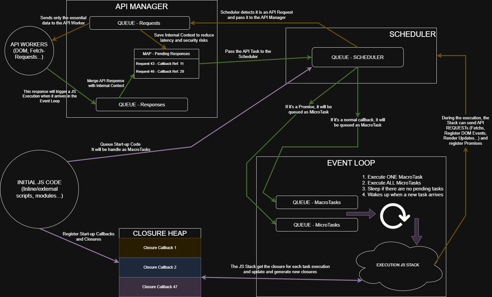

# JavaScript Engine Simulator in C++

The goal of this JS engine simulation is to demonstrate, in a practical and visual way, the fundamental concepts of asynchronous concurrency, such as the **Event Loop**, **Macro Task** and **Micro Task** queues, I/O (API) management, and the **Closure Heap**.

> 📘 **Este documento también está disponible en español:**  
> [Leer en español](README-es.md)

The simulation is built on a multi-threaded architecture that isolates the main components of the engine, allowing us to observe how they interact to process tasks without blocking the main execution thread, mimicking the behavior of environments like Node.js or the browser.

## Architecture and Execution Flow

The following diagram is the centerpiece for understanding the system's execution flow.



If you want to dive deeper into my reasoning behind the "asynchronous" JS model: ➡️ **[Read the full JSEngine Blueprint here](./JSEngine-Blueprint-en.md)**

### Main Components

1.  **Event Loop**: It is the heart of the engine. It orchestrates the execution of tasks following a strict cycle:
    *   1. Executes **ONE** Macro Task from its queue.
    *   2. Executes **ALL** Micro Tasks until the queue is empty.
    *   3. (Optional) Proceeds to render changes.
    *   4. If there are no more tasks, it "goes to sleep" until a new task arrives.

2.  **Scheduler**: Acts as the system's traffic controller. It receives tasks from all sources (the running code or external APIs) and routes them to the correct queue. It is responsible for deciding whether a task is a Micro Task (e.g., a resolved promise) or a Macro Task (e.g., a click event, a traditional API response).

3.  **API Manager & API Workers**: Simulates the "outside world" (browser APIs like `fetch`, `DOM`, etc.).
    *   When JS code requests an I/O operation, the **API Manager** receives the request, saves the original task's context (which contains the **reference** to the callback to be executed), and delegates the work to an **API Worker** (a separate thread). This separation is key: only essential data travels to the "outside world," protecting the engine's internal logic and state.
    *   Once the Worker completes its job, it notifies the API Manager, who rebuilds the task with the result and sends it to the **Scheduler** to be enqueued.

4.  **Closure Heap**: Simulates the engine's memory where function "definitions" (Callbacks) are stored. When a task is created, it does not contain the code itself, but a reference (an ID) to the callback stored in the Heap. This allows the code to persist in memory, ready to be executed when an asynchronous task completes, making the concept of *closures* possible.

5.  **Execution JS Stack**: Represented by the `executeStackJS` function, this is the simulation of the JavaScript Call Stack. It runs on the **Event Loop's** thread and processes the instructions of a callback one by one. From here, executing an instruction can generate **new asynchronous tasks** (like another API call). These new tasks are sent to the **Scheduler** to be processed, thus starting a new asynchronous work cycle.

## How Does It Work Inside? (The C++ Implementation)

The project uses several C++ abstractions to model the engine's behavior safely and efficiently in a concurrent environment.

*   **Multi-threaded Architecture**: The `main.cpp` file launches three main threads that run concurrently:
    1.  `scheduler_thread`: The Scheduler's thread.
    2.  `api_manager_thread`: The thread that manages I/O operations.
    3.  `event_loop_thread`: The thread that simulates single-threaded JS execution.

*   **Thread-Safe Communication (`TaskQueue.h`)**: Communication between threads is handled through thread-safe queues (`TaskQueue`). This class wraps a `std::deque` with a `std::mutex` to ensure that task insertion and extraction operations are atomic, preventing race conditions.

*   **Efficient Synchronization (`Alarm.h`)**: To prevent threads from unnecessarily consuming CPU while waiting for tasks (busy-waiting), the `Alarm` class is used. It encapsulates a `std::condition_variable` and allows a thread to "sleep" (`wait()`) efficiently. The key to its design is that a thread's `Alarm` object is shared by reference with other threads that need to wake it up. They can call it with `notify()` when they have produced a new task, creating a very efficient producer-consumer model.

*   **Simulating JS Code (`Callback.h` & `ClosureHeap.h`)**:
    *   "JavaScript code" is represented by the `Callback` struct, which contains a vector of `Instruction`. Each `Instruction` represents a simple, individual operation (like `LOG` or `API_REQUEST`).
    *   The `ClosureHeap` acts as a central repository (`std::map`) that associates a `long long id` with each `Callback`, simulating how the engine's memory stores functions.

*   **The Task as a Message (`Task.h`)**: The `Task` struct is the message that flows throughout the system. It contains all the necessary information for its processing: its origin (`source`), its type (`is_promise`), the ID of the callback to execute (`callback_id`), and any associated data (`data`).

## How to Compile and Run

You can compile the project using a C++ compiler compatible with C++17. The `-pthread` flag is required for thread management.

```code
g++ main.cpp -o JSengine -std=c++17 -pthread
```

Once compiled, run the simulator:
```code
./JSengine
```

The program will start the engine's threads, which will enter a waiting state (`Going to sleep...`), and present an interactive control panel. This panel allows you to inject tasks into the system to observe their behavior in real-time, as seen in the logs.

### Simulation Options:

1.  **Simulate a chained promise (`fetch().then()`):**
    *   **What it does:** This option injects an API *response*, simulating the resolution of an initial promise.
    *   **What to observe in the log:** You will see the **Scheduler** identify it (`is_promise: true`) and route it directly to the **Micro Task** queue. The **Event Loop** executes it immediately. The most interesting part is that the code in this first microtask generates a *new* API request, which, upon resolution, is also enqueued as a Micro Task and executed.
    *   **The key concept:** This flow demonstrates the **high-priority path** that promises follow and how the system is designed to resolve chained operations consecutively and predictably, which is fundamental for managing asynchronous data flows.

2.  **Simulate a DOM click event (Macrotask):**
    *   **What it does:** This option simulates an external event, like a user click or a `setTimeout` completion.
    *   **What to observe in the log:** Unlike the previous one, the **Scheduler** identifies this task as standard (`is_promise: false`) and routes it to the **Macro Task** queue.
    *   **The key concept:** This simulation isolates and demonstrates the **standard path** for general events. Although it doesn't compete with any microtasks in this test, it illustrates the mechanism by which user interactions and other common asynchronous tasks are managed. It represents the base cycle of the Event Loop, which by design would always prioritize microtasks before processing a macrotask.

## File Structure

```code
.
├── Alarm.h                 # Synchronization primitive for sleeping/waking threads.
├── Callback.h              # Defines structures to simulate JS code (Callback, Instruction).
├── ClosureHeap.h           # Simulates the engine's memory where callbacks are stored.
├── main.cpp                # Entry point. Launches threads and contains the logic for each component.
├── Task.h                  # Defines the Task struct, the message that flows through the system.
├── TaskQueue.h             # Implementation of a generic thread-safe queue.
```